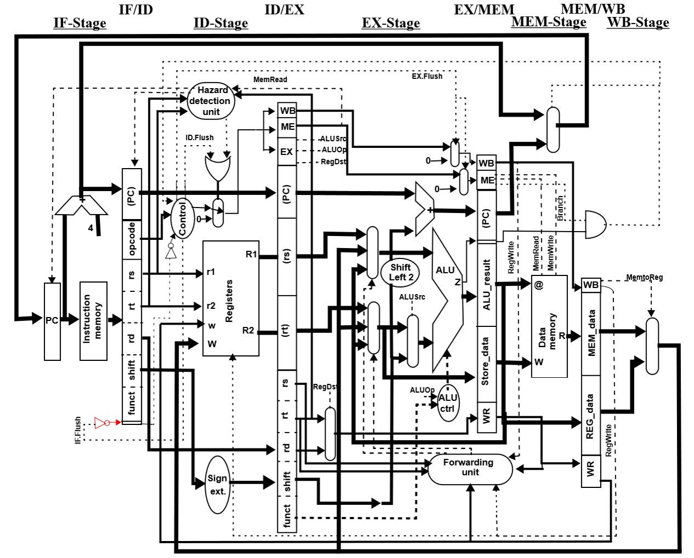
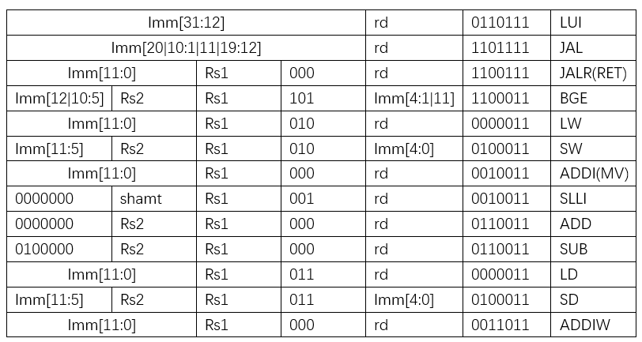

# Lab7 Report v2

**Remote repository address : https://github.com/hzhang2422/EE-533-Team4**

Members: Yijie Zhou, Jiahe Wu, Haoyang Zhang, Bohan Fang


* [High-level design of the datapath](#1)
* [Instruction Set Architecture](#2)
* [Bubble sort in C and Assembly](#3)
* [MACHINE CODE](#4)
* [NetFPGA](#5)


<h4 id="1"> High-level design of the datapath </h4>




<h4 id="2"> Instruction Set Architecture(Part of RV64I) </h4>




<h4 id="3"> Bubble sort in C, Assembly and Machine Code </h3>

**Bubble sort in C**

````c
int main() { 
   int array[10] = {323, 123, -455, 2, 98, 125, 10, 65, -56, 0}; 
   int i, j, swap; 
   for (i = 0 ; i < 10; i++) { 
      for (j = i+1 ; j < 10 ; j++) { 
         if (array[j] < array[i]) { 
            swap = array[j]; 
            array[j] = array[i]; 
            array[i] = swap; 
         } 
      } 
   } 
} 
````


**Bubble sort in Assembly**

sort.c => sort.s

````cmd
sudo apt install gcc-riscv64-unknown-elf
riscv64-unknown-elf-gcc -march=rv64i -mabi=lp64 -S sort.c -o sort.s
````


```assembly
	.file	"sort.c"
	.option nopic
	.attribute arch, "rv64i2p1"
	.attribute unaligned_access, 0
	.attribute stack_align, 16
	.text
	.section	.rodata
	.align	3
.LC0:
	.word	323
	.word	123
	.word	-455
	.word	2
	.word	98
	.word	125
	.word	10
	.word	65
	.word	-56
	.word	0
	.text
	.align	2
	.globl	main
	.type	main, @function
main:
	addi	sp,sp,-80
	sd	s0,72(sp)
	addi	s0,sp,80
	lui	a5,%hi(.LC0)
	addi	a5,a5,%lo(.LC0)
	ld	a1,0(a5)
	ld	a2,8(a5)
	ld	a3,16(a5)
	ld	a4,24(a5)
	ld	a5,32(a5)
	sd	a1,-72(s0)
	sd	a2,-64(s0)
	sd	a3,-56(s0)
	sd	a4,-48(s0)
	sd	a5,-40(s0)
	sw	zero,-20(s0)
	j	.L2
.L6:
	lw	a5,-20(s0)
	addiw	a5,a5,1
	sw	a5,-24(s0)
	j	.L3
.L5:
	lw	a5,-24(s0)
	slli	a5,a5,2
	addi	a5,a5,-16
	add	a5,a5,s0
	lw	a4,-56(a5)
	lw	a5,-20(s0)
	slli	a5,a5,2
	addi	a5,a5,-16
	add	a5,a5,s0
	lw	a5,-56(a5)
	bge	a4,a5,.L4
	lw	a5,-24(s0)
	slli	a5,a5,2
	addi	a5,a5,-16
	add	a5,a5,s0
	lw	a5,-56(a5)
	sw	a5,-28(s0)
	lw	a5,-20(s0)
	slli	a5,a5,2
	addi	a5,a5,-16
	add	a5,a5,s0
	lw	a4,-56(a5)
	lw	a5,-24(s0)
	slli	a5,a5,2
	addi	a5,a5,-16
	add	a5,a5,s0
	sw	a4,-56(a5)
	lw	a5,-20(s0)
	slli	a5,a5,2
	addi	a5,a5,-16
	add	a5,a5,s0
	lw	a4,-28(s0)
	sw	a4,-56(a5)
.L4:
	lw	a5,-24(s0)
	addiw	a5,a5,1
	sw	a5,-24(s0)
.L3:
	lw	a5,-24(s0)
	sext.w	a4,a5
	li	a5,9
	ble	a4,a5,.L5
	lw	a5,-20(s0)
	addiw	a5,a5,1
	sw	a5,-20(s0)
.L2:
	lw	a5,-20(s0)
	sext.w	a4,a5
	li	a5,9
	ble	a4,a5,.L6
	li	a5,0
	mv	a0,a5
	ld	s0,72(sp)
	addi	sp,sp,80
	jr	ra
	.size	main, .-main
	.ident	"GCC: (13.2.0-11ubuntu1+12) 13.2.0"
```


**Bubble sort in Machine Code**

1. Compile C code to RV64I binary (ELF format)

   ```cmd
   riscv64-unknown-elf-gcc -march=rv64i -mabi=lp64 sort.c -o sort.elf
   ```

2. Then use objdump to view the disassembled code

   ````cmd
   riscv64-unknown-elf-objdump -d sort.elf > sort.dump
   ````

````assembly
0000000000000000 <main>:
   0:	fb010113          	addi	sp,sp,-80  // 111110110000 00010 000 00010 0010011
   4:	04813423          	sd	s0,72(sp)  // 00000100100000010011010000100011
   8:	05010413          	addi	s0,sp,80  // 00000101000000010000010000010011
   c:	000007b7          	lui	a5,0x0     // 00000000000000000000011110110111
  10:	00078793          	mv	a5,a5      // 00000000000001111000011110010011
  14:	0007b583          	ld	a1,0(a5)   // 00000000000001111011010110000011
  18:	0087b603          	ld	a2,8(a5)   // 00000000100001111011011000000011
  1c:	0107b683          	ld	a3,16(a5)  // 00000001000001111011011010000011
  20:	0187b703          	ld	a4,24(a5)  // 00000001100001111011011100000011
  24:	0207b783          	ld	a5,32(a5)  // 00000010000001111011011110000011
  28:	fab43c23          	sd	a1,-72(s0) // 11111010101101000011110000100011
  2c:	fcc43023          	sd	a2,-64(s0) // 11111100110001000011000000100011
  30:	fcd43423          	sd	a3,-56(s0) // 11111100110101000011010000100011
  34:	fce43823          	sd	a4,-48(s0) // 11111100111001000011100000100011
  38:	fcf43c23          	sd	a5,-40(s0) // 11111100111101000011110000100011
  3c:	fe042623          	sw	zero,-20(s0) // 11111110000001000010011000100011
  40:	0c00006f          	j	100 <.L2>  // 00001100000000000000 00000 1101111  imm:000 1100 0000（40+c0）

0000000000000044 <.L6>:
  44:	fec42783          	lw	a5,-20(s0) // 11111110110001000010011110000011
  48:	0017879b          	addiw	a5,a5,1  // 00000000000101111000011110011011
  4c:	fef42423          	sw	a5,-24(s0) // 11111110111101000010010000100011
  50:	0940006f          	j	e4 <.L3>   // 00001001010000000000 00000 1101111  imm:000 1001 0100 （50+94）

0000000000000054 <.L5>:
  54:	fe842783          	lw	a5,-24(s0) // 11111110100001000010011110000011
  58:	00279793          	slli	a5,a5,0x2 // 0000000 00010 01111 001 01111 0010011 
  5c:	ff078793          	addi	a5,a5,-16 // 11111111000001111000111110010011
  60:	008787b3          	add	a5,a5,s0  // 00000000100001111010011110110011
  64:	fc87a703          	lw	a4,-56(a5) // 11111100100001111010011100000011
  68:	fec42783          	lw	a5,-20(s0) // 11111110110001000010011110000011
  6c:	00279793          	slli	a5,a5,0x2 // 00000000001001111001011110010011
  70:	ff078793          	addi	a5,a5,-16 // 11111111000001111000111110010011
  74:	008787b3          	add	a5,a5,s0  // 00000000100001111010011110110011
  78:	fc87a783          	lw	a5,-56(a5) // 11111100100001111010011110000011
  7c:	04f75e63          	bge	a4,a5,d8 <.L4> // 0000010 01111 01110 101 11100 1100011  imm:00000 0101 1100 （7c+5c）
  80:	fe842783          	lw	a5,-24(s0) // 11111110100001000010011110000011
  84:	00279793          	slli	a5,a5,0x2 // 00000000001001111001011110010011
  88:	ff078793          	addi	a5,a5,-16 // 11111111000001111000111110010011
  8c:	008787b3          	add	a5,a5,s0  // 00000000100001111010011110110011
  90:	fc87a783          	lw	a5,-56(a5) // 11111100100001111010011110000011
  94:	fef42223          	sw	a5,-28(s0) // 11111110111101000010001000100011
  98:	fec42783          	lw	a5,-20(s0) // 11111110110001000010011110000011
  9c:	00279793          	slli	a5,a5,0x2 // 00000000001001111001011110010011
  a0:	ff078793          	addi	a5,a5,-16 // 11111111000001111000111110010011
  a4:	008787b3          	add	a5,a5,s0  // 00000000100001111010011110110011
  a8:	fc87a703          	lw	a4,-56(a5) // 11111100100001111010011100000011
  ac:	fe842783          	lw	a5,-24(s0) // 11111110100001000010011110000011
  b0:	00279793          	slli	a5,a5,0x2 // 00000000001001111001011110010011
  b4:	ff078793          	addi	a5,a5,-16 // 11111111000001111000111110010011
  b8:	008787b3          	add	a5,a5,s0  // 00000000100001111010011110110011
  bc:	fce7a423          	sw	a4,-56(a5) // 11111100111001111010010000100011
  c0:	fec42783          	lw	a5,-20(s0) // 11111110110001000010011110000011
  c4:	00279793          	slli	a5,a5,0x2 // 00000000001001111001011110010011
  c8:	ff078793          	addi	a5,a5,-16 // 11111111000001111000111110010011
  cc:	008787b3          	add	a5,a5,s0  // 00000000100001111010011110110011
  d0:	fe442703          	lw	a4,-28(s0) // 11111110010001000010011100000011
  d4:	fce7a423          	sw	a4,-56(a5) // 11111100111001111010010000100011

00000000000000d8 <.L4>:
  d8:	fe842783          	lw	a5,-24(s0) // 11111110100001000010011110000011
  dc:	0017879b          	addiw	a5,a5,1  // 00000000000101111000011110011011
  e0:	fef42423          	sw	a5,-24(s0) // 11111110111101000010010000100011

00000000000000e4 <.L3>:
  e4:	fe842783          	lw	a5,-24(s0) // 111111101000 01000 010 01111 0000011
  e8:	0007871b          	sext.w	a4,a5  //addiw a4,a5,0  000000000000 01111 000 01110 0011011
  ec:	00900793          	li	a5,9     //addiw a5,a0,9  000000001001 00000 000 01111 0010011
  f0:	f6e7d2e3          	bge	a5,a4,54 <.L5> // 1111011 01110 01111 101 00101 1100011   imm:111110110010
  f4:	fec42783          	lw	a5,-20(s0) // 11111110110001000010011110000011
  f8:	0017879b          	addiw	a5,a5,1  // 00000000000101111000011110011011
  fc:	fef42623          	sw	a5,-20(s0) // 11111110111101000010011000100011

0000000000000100 <.L2>:
 100:	fec42783          	lw	a5,-20(s0) // 11111110110001000010011110000011
 104:	0007871b          	sext.w	a4,a5  //addiw a4,a5,0 000000000000 01111 000 01110 0011011
 108:	00900793          	li	a5,9     //addiw a5,a0,9 000000001001 00000 000 01111 0010011
 10c:	f2e7dce3          	bge	a5,a4,44 <.L6> // 11110010111001111101110011100011
 110:	00000793          	li	a5,0     //addiw a5,a0,0 000000000000 00000 000 01111 0010011
 114:	00078513          	mv	a0,a5    //addi a0,a5,0 000000000000 01111 000 01010 0010011
 118:	04813403          	ld	s0,72(sp) // 00000100100000010011010000000011
 11c:	05010113          	addi	sp,sp,80 // 00000101000000010000000100010011
 120:	00008067          	ret         //jalr zero,ra,0 000000000000 00001 000 00000 1100111
````

