# Lab7 report
**Remote repository address : https://github.com/hzhang2422/EE-533-Team4**

Members: Yijie Zhou, Jiahe Wu, Haoyang Zhang, Bohan Fang


* [High-level design of the datapath](#1)
* [Instruction Set Architecture](#2)
* [Bubble sort in C and Assembly](#3)
* [MACHINE CODE](#4)
* [NetFPGA](#5)


<h4 id="1"> High-level design of the datapath </h4>


<h4 id="2"> Instruction Set Architecture </h4>

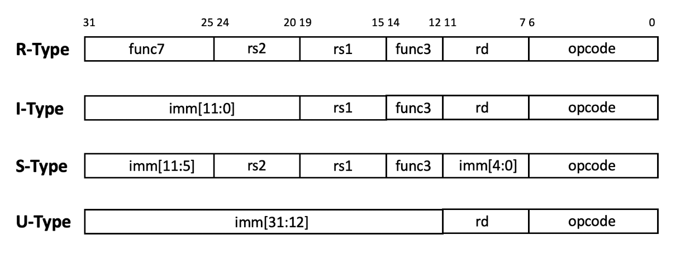

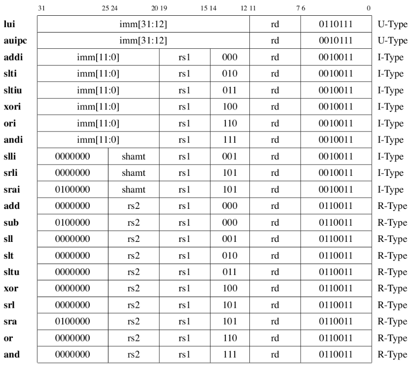

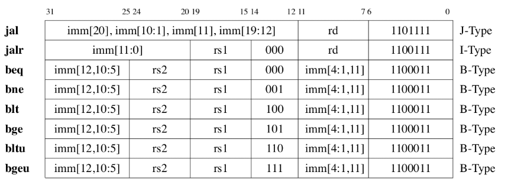

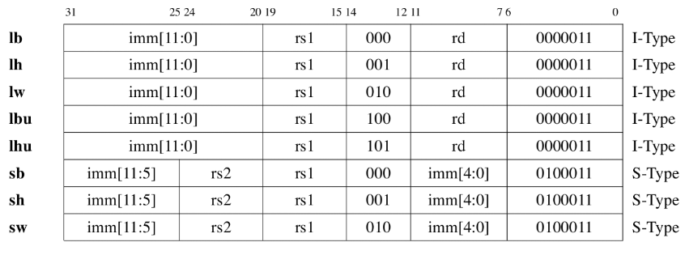


<h4 id="3"> Bubble sort in C and Assembly </h3>


**Bubble sort in C**

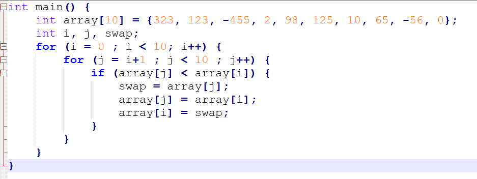


**Bubble sort in Assembly**

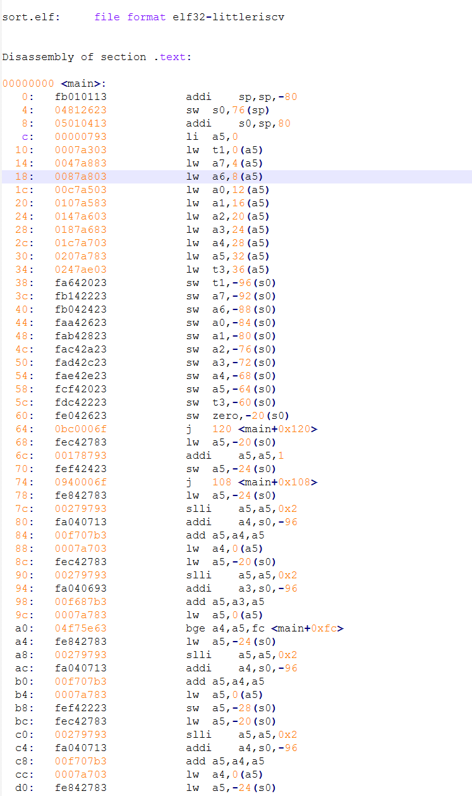

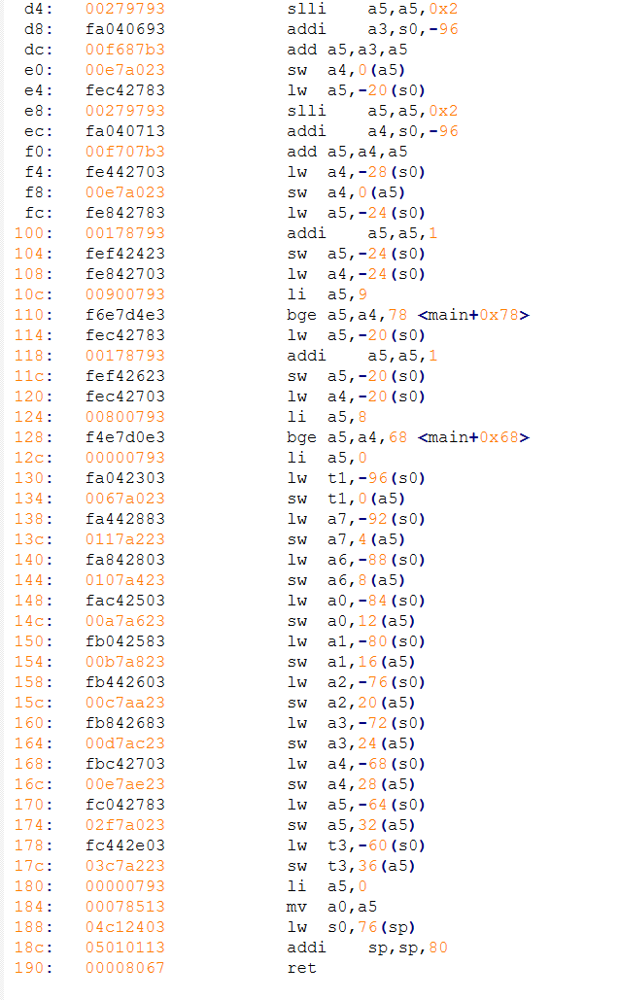


We use the following **python script** to extract the machine code generated.

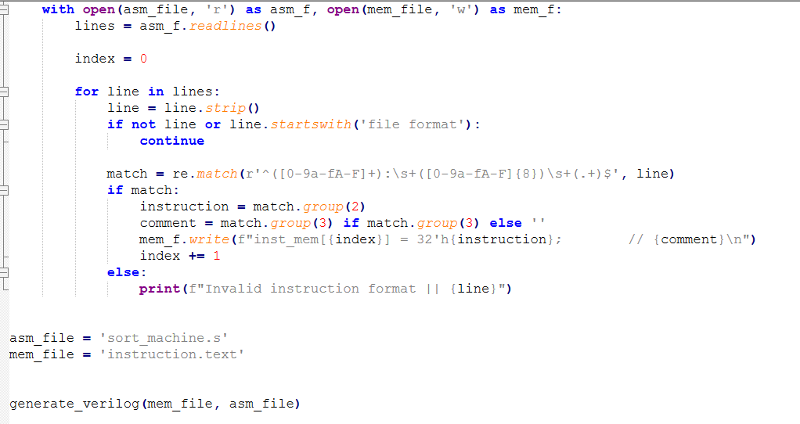


**Machine code**

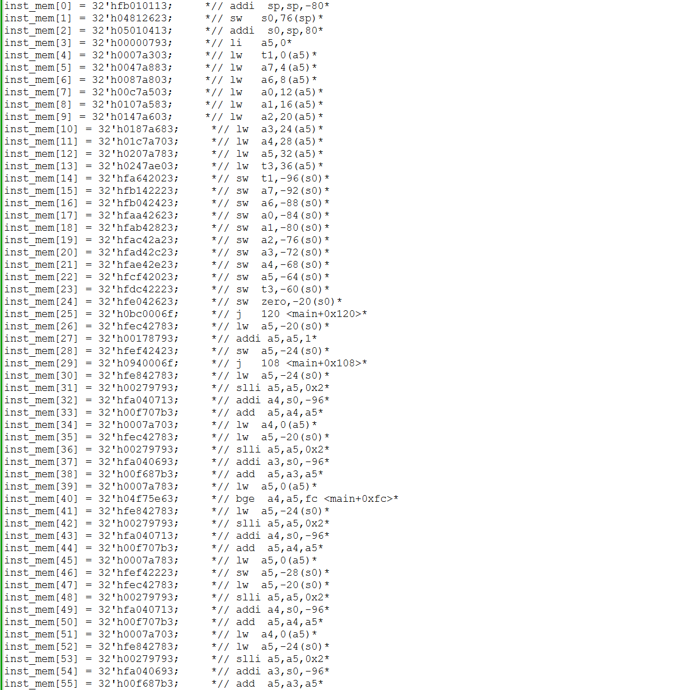

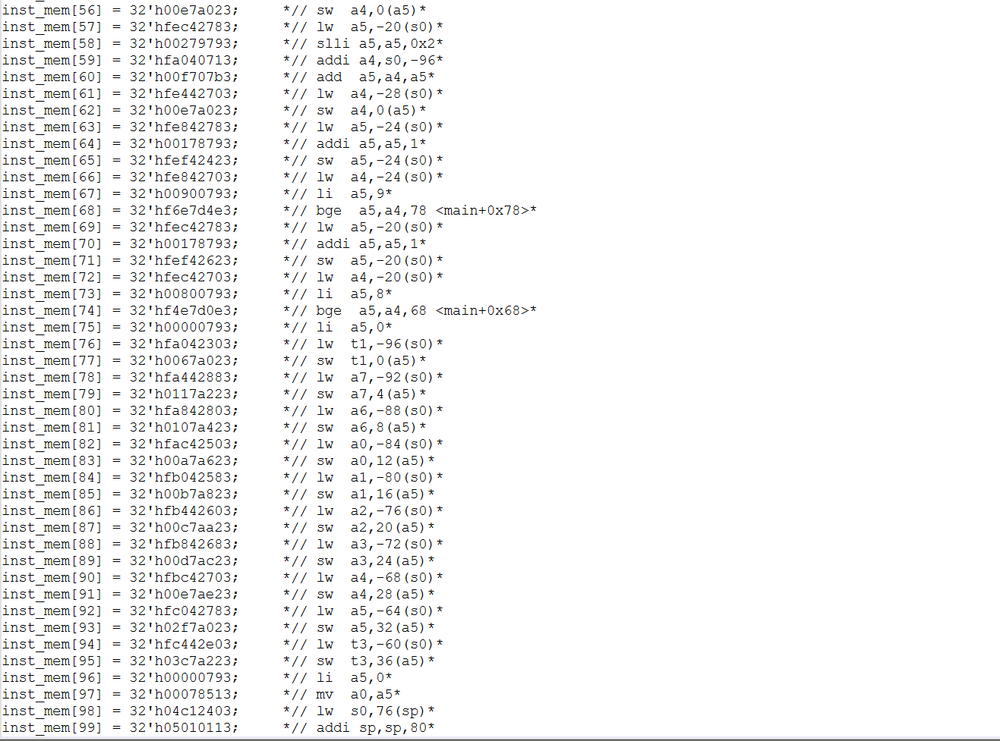


**The transcript of a sequence of commands typed to the interface**

- SW/HW interface in pipeline module

  - Verilog module

    ```
    	// pipeline_netfpga.v
    
    	// Software registers
    	wire [7:0]									mem_raddr_ver;
    
       	// Hardware registers
      	wire [63:0]								   	mem_rdata_ver;
    	wire [31:0]								   	mem_rdata_ver_high;	
       	wire [31:0]								   	mem_rdata_ver_low;
    
    	// Verification(D-MEM)
    	assign mem_rdata_ver = dmem_rdata;
       	assign mem_rdata_ver_low = mem_rdata_ver[63:32];
       	assign mem_rdata_ver_high = mem_rdata_ver[31:0];
    
    	// ......
    
    	generic_regs
       #( 
          .UDP_REG_SRC_WIDTH   (UDP_REG_SRC_WIDTH),
          .TAG                 (`PIPELINE_BLOCK_ADDR),          // Tag -- eg. MODULE_TAG
          .REG_ADDR_WIDTH      (`PIPELINE_REG_ADDR_WIDTH),     // Width of block addresses -- eg. MODULE_REG_ADDR_WIDTH
          .NUM_COUNTERS        (0),                 // Number of counters
          .NUM_SOFTWARE_REGS   (1),                 // Number of sw regs
          .NUM_HARDWARE_REGS   (2)                  // Number of hw regs
       ) module_regs (
          .reg_req_in       (reg_req_in),
          .reg_ack_in       (reg_ack_in),
          .reg_rd_wr_L_in   (reg_rd_wr_L_in),
          .reg_addr_in      (reg_addr_in),
          .reg_data_in      (reg_data_in),
          .reg_src_in       (reg_src_in),
    
          .reg_req_out      (reg_req_out),
          .reg_ack_out      (reg_ack_out),
          .reg_rd_wr_L_out  (reg_rd_wr_L_out),
          .reg_addr_out     (reg_addr_out),
          .reg_data_out     (reg_data_out),
          .reg_src_out      (reg_src_out),
    
          // --- counters interface
          .counter_updates  (),
          .counter_decrement(),
    
          // --- SW regs interface
          .software_regs    (mem_raddr_ver),
    
          // --- HW regs interface
          .hardware_regs    ({mem_rdata_ver_high, mem_rdata_ver_low}),
    
          .clk              (clk),
          .reset            (reset)
        );
    ```

    

- **Registers in pipeline.xml**

  ```
  <?xml version="1.0" encoding="UTF-8"?>
  <nf:module xmlns:nf="http://www.NetFPGA.org/NF2_register_system" xmlns:xsi="http://www.w3.org/2001/XMLSchema-instance" xsi:schemaLocation="http://www.NetFPGA.org/NF2_register_system NF2_register_system.xsd ">
  	<nf:name>pipeline</nf:name>
  	<nf:prefix>pipeline</nf:prefix>
  	<nf:location>udp</nf:location>
  	<nf:description>Registers for PIPELINE</nf:description>
  	<nf:blocksize>64</nf:blocksize>
  	<nf:registers>
  		<nf:register>
  		  <nf:name>mem_raddr_ver</nf:name>
  			<nf:description>D-MEM Read Address</nf:description>
  			<nf:type>generic_software32</nf:type>
  		</nf:register>
  		<nf:register>
  		  <nf:name>mem_rdata_ver_high</nf:name>
  			<nf:description>Upper 32 bits of D-MEM Read Data</nf:description>
  			<nf:type>generic_hardware32</nf:type>
  		</nf:register>
          	<nf:register>
  		  <nf:name>mem_rdata_ver_low</nf:name>
  			<nf:description>Lower 32 bits of D-MEM Read Data</nf:description>
  			<nf:type>generic_hardware32</nf:type>
  		</nf:register>
  	</nf:registers>
  </nf:module>
  ```

  

**The internal memory dump that shows the array data before and after sort program execution**

The last line is swapped to -455: 

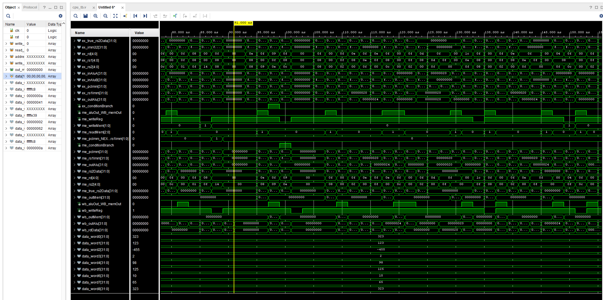

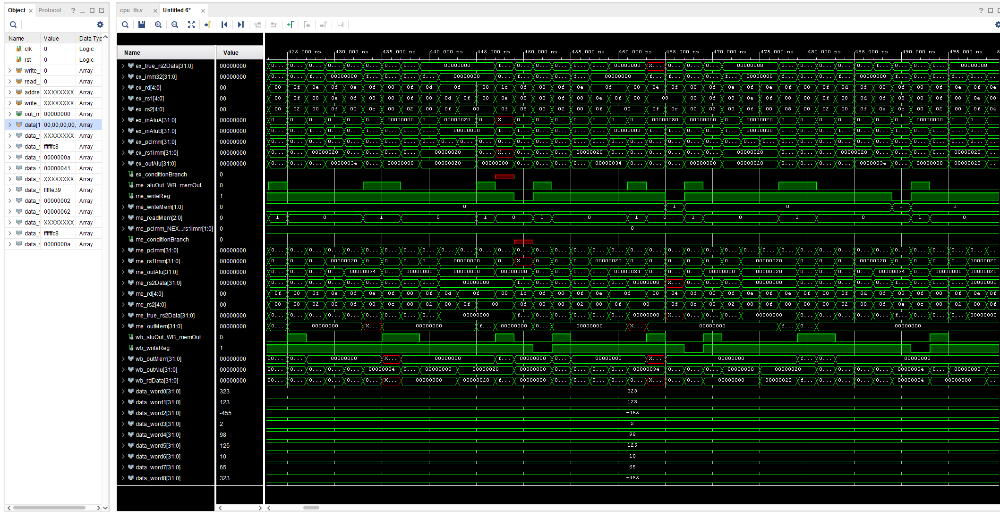


<h4 id="5"> NetFPGA </h4>

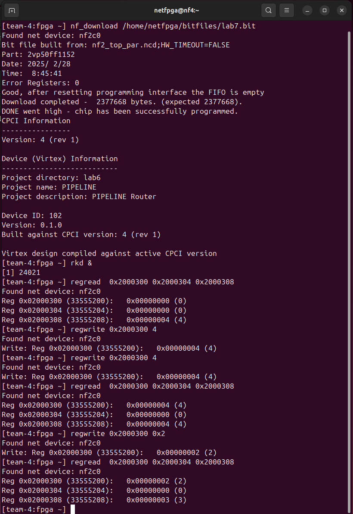


Commit log

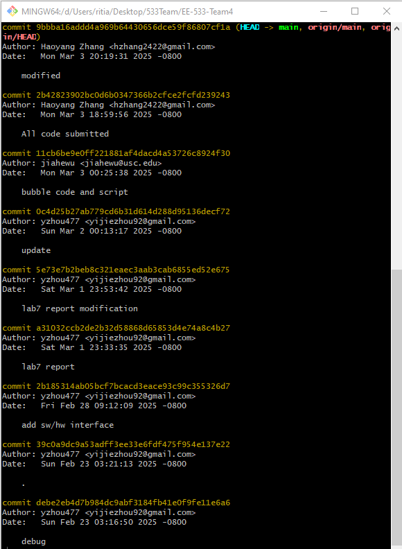