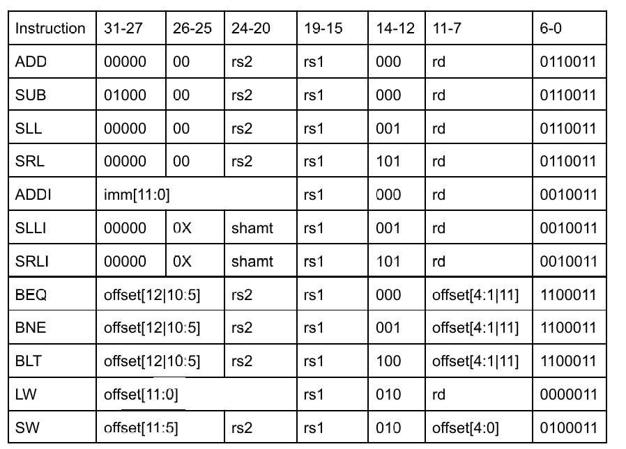
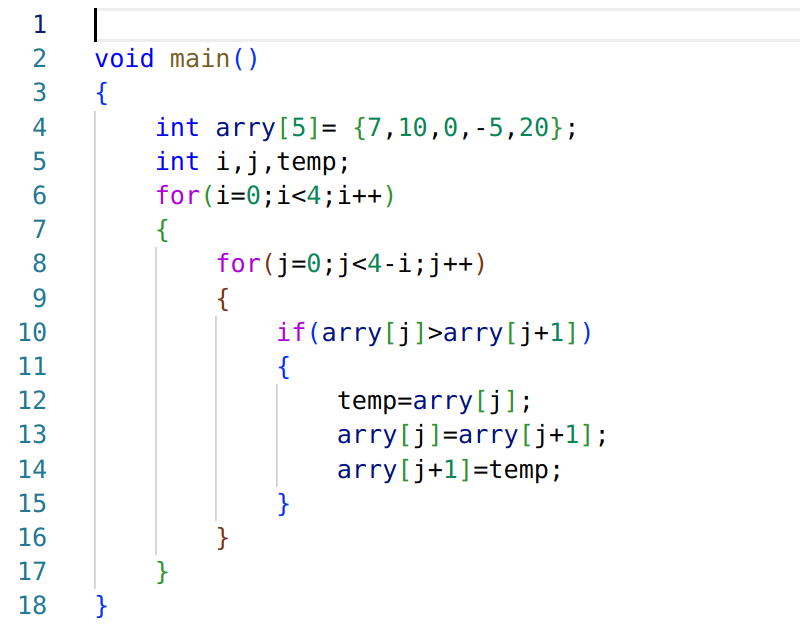
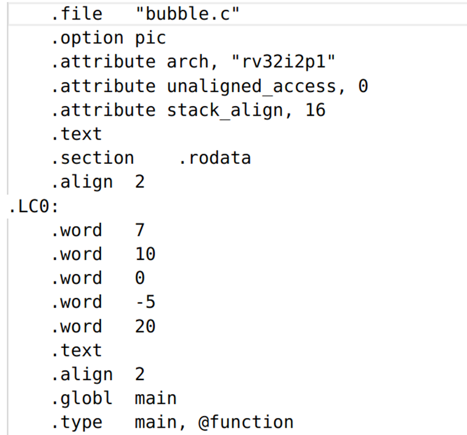
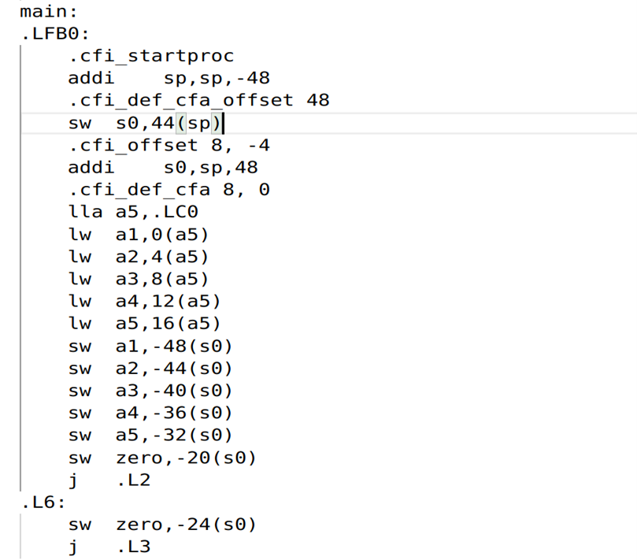
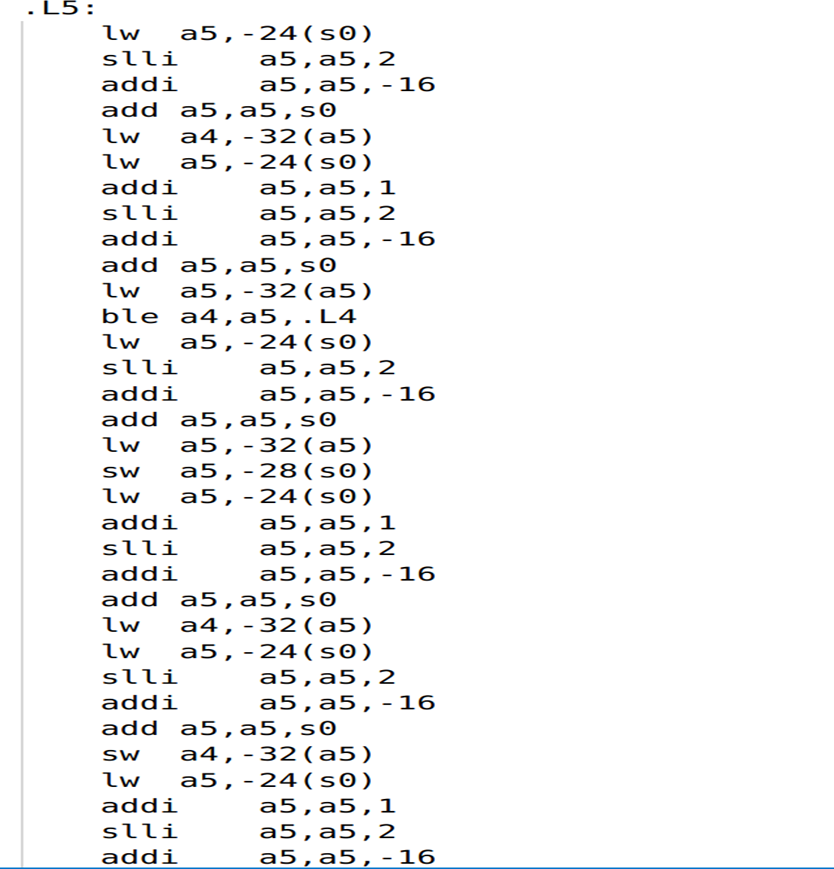
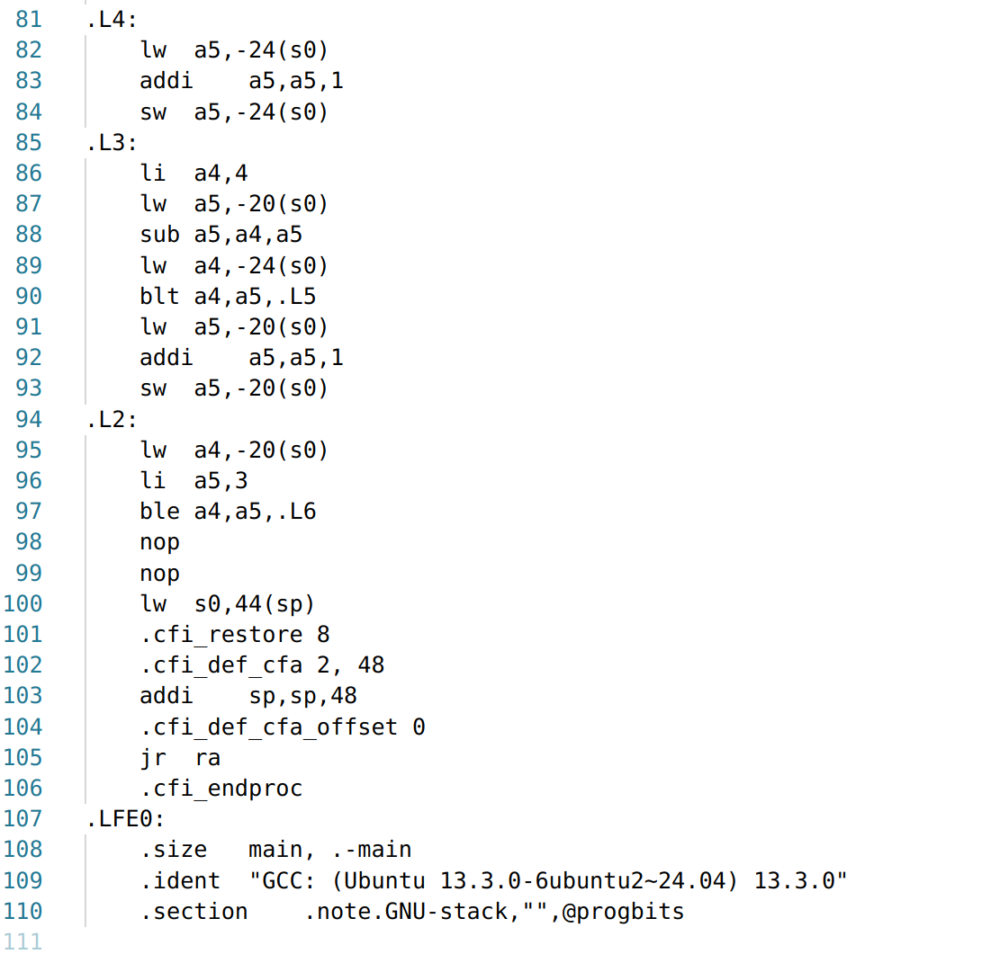
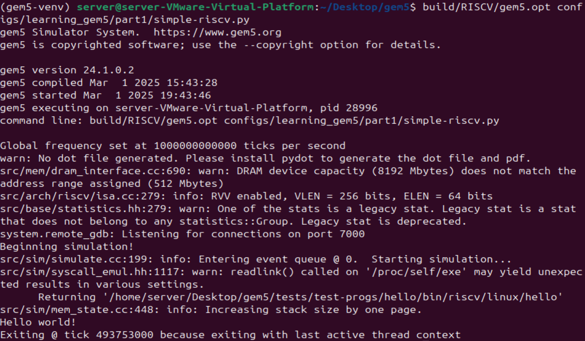

# Lab7 report
**Remote repository address : https://github.com/hzhang2422/EE-533-Team4**

Members: Yijie Zhou, Jiahe Wu, Haoyang Zhang, Bohan Fang

* [High-level design of the datapath](#1)
* [Instruction Set Architecture](#2)
* [Bubble sort in C and Assembly](#3)
* [MACHINE CODE](#4)
* [NetFPGA](#5)

<h4 id="1"> High-level design of the datapath </h4>

<h4 id="2"> Instruction Set Architecture </h4>

<h4 id="3"> Bubble sort in C and Assembly </h3>

Bubble sort in C

Bubble sort in Assembly

<h4 id="4"> MACHINE CODE </h4>

=== MACHINE CODE IN BINARY FORMAT (0s and 1s) ===

11111101110000010000000100010011 # Instruction 1

00000010100000010010011000100011 # Instruction 2

00000011000000010000010000010011 # Instruction 3

00000000000000000111011110010111 # Instruction 4

00000000000001111010010110000011 # Instruction 5

00000000010001111010011000000011 # Instruction 6

00000000100001111010011010000011 # Instruction 7

00000000110001111010011100000011 # Instruction 8

00000001000001111010011110000011 # Instruction 9

11111100101101000010100000100011 # Instruction 10

11111100110001000010101000100011 # Instruction 11

11111100110101000010110000100011 # Instruction 12

11111100111001000010111000100011 # Instruction 13

11111110111101000010000000100011 # Instruction 14

11111110000001000010101000100011 # Instruction 15

00000001100000000000000001101111 # Instruction 16

11111110000001000010100000100011 # Instruction 17

00000010000000000000000001101111 # Instruction 18

11111110100001000010011110000011 # Instruction 19

00000000001001111001011110010011 # Instruction 20

11111111000001111000011110010011 # Instruction 21

00000000111101000000011110110011 # Instruction 22

11111110000001111010011100000011 # Instruction 23

11111110100001000010011110000011 # Instruction 24

00000000000101111000011110010011 # Instruction 25

00000000001001111001011110010011 # Instruction 26

11111111000001111000011110010011 # Instruction 27

00000000111101000000011110110011 # Instruction 28

11111110000001111010011110000011 # Instruction 29

00000000111101110101101001100011 # Instruction 30

11111110100001000010011110000011 # Instruction 31

00000000001001111001011110010011 # Instruction 32

11111111000001111000011110010011 # Instruction 33

00000000111101000000011110110011 # Instruction 34

11111110000001111010011110000011 # Instruction 35

11111110111101000010011000100011 # Instruction 36

11111110100001000010011110000011 # Instruction 37

00000000000101111000011110010011 # Instruction 38

00000000001001111001011110010011 # Instruction 39

11111111000001111000011110010011 # Instruction 40

00000000111101000000011110110011 # Instruction 41

11111110000001111010011100000011 # Instruction 42

11111110100001000010011110000011 # Instruction 43

00000000001001111001011110010011 # Instruction 44

11111111000001111000011110010011 # Instruction 45

00000000111101000000011110110011 # Instruction 46

11111110111001111010000000100011 # Instruction 47

11111110100001000010011110000011 # Instruction 48

00000000000101111000011110010011 # Instruction 49

00000000001001111001011110010011 # Instruction 50

11111111000001111000011110010011 # Instruction 51

00000000111101000000011110110011 # Instruction 52

11111110110001000010011100000011 # Instruction 53

11111110111001111010000000100011 # Instruction 54

11111110100001000010011110000011 # Instruction 55

00000000000101111000011110010011 # Instruction 56

11111110111101000010100000100011 # Instruction 57

00000000010000000000011100010011 # Instruction 58

11111110110001000010011110000011 # Instruction 59

01000000111101110000011110110011 # Instruction 60

11111110100001000010011100000011 # Instruction 61

11111010111101110100101011100011 # Instruction 62

11111110110001000010011110000011 # Instruction 63

00000000000101111000011110010011 # Instruction 64

11111110111101000010101000100011 # Instruction 65

11111110110001000010011100000011 # Instruction 66

00000000001100000000011110010011 # Instruction 67

11111010111101110100110011100011 # Instruction 68

00000000000000000000000000010011 # Instruction 69

00000000000000000000000000010011 # Instruction 70

00000010110000010010010000000011 # Instruction 71

00000011000000010000000100010011 # Instruction 72

00000000000000001000000001100111 # Instruction 73

<h4 id="5"> NetFPGA </h4>

