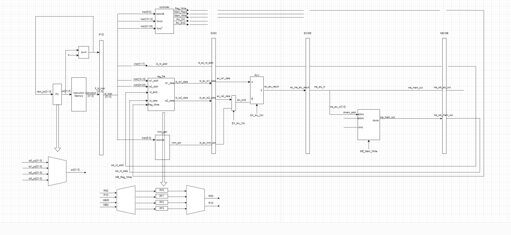
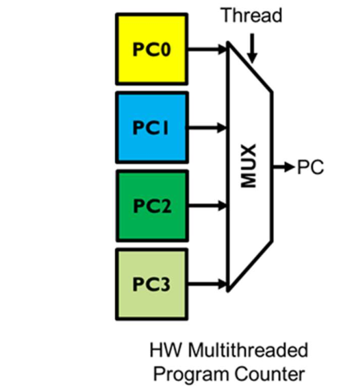
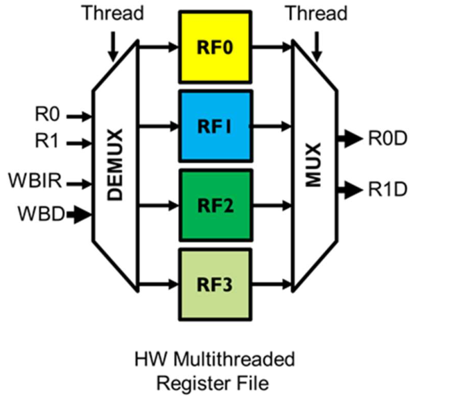
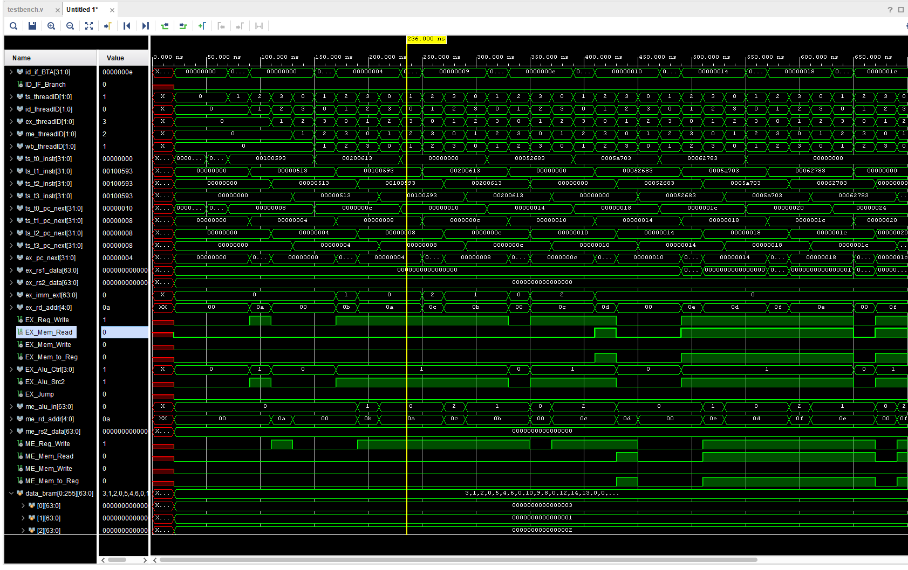

# Lab9 report
**Remote repository address : https://github.com/hzhang2422/EE-533-Team4**

Members: Yijie Zhou, Jiahe Wu, Haoyang Zhang, Bohan Fang


### Part1 :  Hardware Augmentation

- The high-level design of the datapath.




##### Step1: build a 4-thread program counter 

- illustration:

  

- implementation：

  - single-thread PC：

  ```verilog
  module PC (
  	input				clk,
  	input				rst,
  	input				stall,
  	input		[31:0]	pc_next,
  	output	reg	[31:0]	pc
  );
  
  	always @(posedge clk or posedge rst) begin
  		if (rst)
  			pc <= 32'h0000_0000;
  		else if (stall == 1'b0)
  			pc <= pc_next;
  	end
  endmodule
  ```

  

  - 4-thread PC generation and initialization in IF stage:

  ```verilog
  wire		[3:0]				TS_Thread, ID_Thread;
  	wire		[31:0]				pc	[3:0];
  	wire		[31:0]				if_pc_next [3:0];
  	wire		[3:0]				BrJr, Stall;
  	
  	genvar i;
  	generate
  		for (i = 0; i < 4; i = i + 1) begin
  			assign TS_Thread[i] = (ts_threadID == i[1:0]); 
  			assign ID_Thread[i] = (id_threadID == i[1:0]);
  	
  			assign if_pc_next[i] = (IF_Branch || IF_Jump) && ID_Thread[i] ? 
  							(IF_Branch ? if_BTA : if_JTA) : pc[i] + 4;
  	
  			assign BrJr[i] = ID_Thread[i] && (IF_Branch || IF_Jump);
  			assign Stall[i] = ~TS_Thread[i] && ~TS_Thread[i];
  			
  			PC pc_reg(
  				.clk(clk),
  				.rst(rst),
  				.stall(Stall[i]),
  				.pc_next(if_pc_next[i]),
  				.pc(pc[i])
  			);
  			
  		end
  	endgenerate
  ```

  

##### Step2: build a 4-thread register file

- illustration:

  

- implementation:

  - single-thread RF:

  ```verilog
  `include "constants.vh"
  
  module Reg_file(
  	input							clk,
  	input							rst,
  	
  	input	[`REG_ADDR_WIDTH-1:0]	rs1_addr,
  	input	[`REG_ADDR_WIDTH-1:0] 	rs2_addr,
  	input	[`REG_ADDR_WIDTH-1:0] 	rd_addr,
  	
  	input							Reg_Write,
  	input	[`DATA_WIDTH-1:0]		rd_data,
  	
  	output	[`DATA_WIDTH-1:0]		rs1_data,
  	output	[`DATA_WIDTH-1:0]		rs2_data,
  	
  	input	[1:0]					id_threadID,
  	input	[1:0]					wb_threadID
  );
  
  	reg		[`DATA_WIDTH-1:0]	registers	[0:127];
  	
  	always @(posedge clk or posedge rst) begin
  		if (rst) begin
  			for (integer i=0; i<128; i=i+1)
  				registers[i] <= 64'h0000_0000;
  		end
  		else begin
  			if (Reg_Write && rd_addr != 5'b00000) begin
  				registers[{wb_threadID, rd_addr}] <= rd_data;
  			end
  		end
  	end
  	
  	assign	rs1_data = registers[{id_threadID,rs1_addr}];
  	assign	rs2_data = registers[{id_threadID,rs2_addr}];
  	
  endmodule
  ```

  

  - 4-thread RF in ID stage:

  ```verilog
  	wire	[`REG_ADDR_WIDTH-1:0]	rs1_addr;
  	wire	[`REG_ADDR_WIDTH-1:0]	rs2_addr;
  	wire	[`REG_ADDR_WIDTH-1:0]	id_rd_addr;
  	
  	assign	rs1_addr = id_instr[19:15];
  	assign	rs2_addr = id_instr[24:20];
  	assign	id_rd_addr = id_instr[11:7];
  	
  	wire	[`DATA_WIDTH-1:0]		id_rs1_data;
  	wire	[`DATA_WIDTH-1:0]		id_rs2_data;
  	
  	Reg_file reg_file(
  		.clk(clk),
  		.rst(rst),
  		.rs1_addr(rs1_addr),
  		.rs2_addr(rs2_addr),
  		.rd_addr(wb_rd_addr),
  		.Reg_Write(WB_Reg_Write),
  		.rd_data(wb_rd_data),
  		.rs1_data(id_rs1_data),
  		.rs2_data(id_rs2_data),
  		.id_threadID(id_threadID),
  		.wb_threadID(wb_threadID)
  	);
  ```

  

##### part 3 : A NEW stage ---- TS stage

- TS stage is to schedule and execute 4 threads

- implementation:

  ```verilog
  `include "constants.vh"
  
  module TS_stage(
  	input							clk,
  	input							rst,
  	
  	input							TS_Jump,
  	input							TS_Branch,
  	
  	input		[31:0]				ts_JTA,
  	input		[31:0]				ts_BTA,
  	
  	input		[1:0] 				ts_threadID,  
  	
  	input 		[`INSTR_WIDTH-1:0] 	ts_t0_instr,
      input 		[31:0]  			ts_t0_pc_next,
      input 		[`INSTR_WIDTH-1:0] 	ts_t1_instr,
      input 		[31:0] 				ts_t1_pc_next,
      input 		[`INSTR_WIDTH-1:0]	ts_t2_instr,
      input 		[31:0]  			ts_t2_pc_next,
      input 		[`INSTR_WIDTH-1:0] 	ts_t3_instr,
      input 		[31:0]  			ts_t3_pc_next,
  	
  	output	reg	[`INSTR_WIDTH-1:0] 	ts_id_instr,
  	output 	reg	[31:0]  			ts_id_pc_next,
  	output	reg	[1:0]				ts_id_threadID
  );
  
  	reg		[`INSTR_WIDTH-1:0]		ts_instr;
  	reg		[31:0]					ts_pc_next;
  	
  	always @(*) begin
  		case(ts_threadID)
  			2'b00: ts_instr = ts_t0_instr;
  			2'b01: ts_instr = ts_t1_instr;
  			2'b10: ts_instr = ts_t2_instr;
  			2'b11: ts_instr = ts_t3_instr;
  			default: ts_instr = 32'b0;
  		endcase
  	end
  	
  	always @(*) begin
  		case(ts_threadID)
  			2'b00: ts_pc_next = ts_t0_pc_next;
  			2'b01: ts_pc_next = ts_t1_pc_next;
  			2'b10: ts_pc_next = ts_t2_pc_next;
  			2'b11: ts_pc_next = ts_t3_pc_next;
  			default: ts_instr = 32'b0;
  		endcase
  	end
  	
  	wire		[1:0]				id_threadID;
  	assign	id_threadID = ts_id_threadID;
  	wire BrJr = (id_threadID==ts_threadID) && (TS_Branch||TS_Jump);
  	
  	always@(posedge clk or posedge rst) begin
  		if (rst) begin
  			ts_id_instr <= 32'b0;
  			ts_id_pc_next <= 32'b0;
  			ts_id_threadID <= 2'b0;
  		end 
  		else if(BrJr == 1'b1) begin
  			ts_id_instr <= 32'b0;
  			ts_id_pc_next <= 32'b0;
  			ts_id_threadID <= 2'b0;
  		end
  		else begin
  			ts_id_instr <= ts_instr;
  			ts_id_pc_next <= ts_pc_next;
  			ts_id_threadID <= ts_threadID;
  		end
  	end
  	
  endmodule
  ```


- Arbiter implementation:

  ```verilog
  module Arbiter(
      input				clk,
      input 				rst,
      input		[3:0]   req,
      output reg	[1:0]	ts_threadID
  );
      reg [3:0] grant;
      reg [1:0] pointer;
      wire [3:0] mask;
      wire [3:0] masked_req;
      wire [3:0] grant_raw;
  
      always @(posedge clk or posedge rst) begin
          if(rst)
              pointer <= 0;
          else if 
              (|req)  pointer <= pointer + 1;
      end
  
      assign mask = (1'b1 << pointer) - 1;
  
      assign masked_req = req & ~mask;
  
      assign grant_raw = masked_req ? masked_req & -masked_req : req & -req;
  
      always @(posedge clk or posedge rst) begin
          if (rst)
              grant <= 0;
          else
              grant <= grant_raw;
      end
  
  
      always @(*) begin
      case (grant)
          4'b0001: ts_threadID = 2'b00;
          4'b0010: ts_threadID = 2'b01;
          4'b0100: ts_threadID = 2'b10;
          4'b1000: ts_threadID = 2'b11;
          default: ts_threadID = 2'b00; 
      endcase
      end
  
  
  endmodule
  ```

  

### Part2 :  Software Verification

- Assume that we sort 4 groups of integer numbers, each with 3 numbers.

  - C code

  ```C
  #include <stdio.h>
  
  void sortThreeNumbers(int *a, int *b, int *c) {
      int temp;
      // 如果a > b，则交换a和b
      if (*a > *b) {
          temp = *a;
          *a = *b;
          *b = temp;
      }
      // 如果a > c，则交换a和c
      if (*a > *c) {
          temp = *a;
          *a = *c;
          *c = temp;
      }
      // 如果b > c，则交换b和c
      if (*b > *c) {
          temp = *b;
          *b = *c;
          *c = temp;
      }
  }
  
  int main() {
      int group1[3] = {45, 23, 78};
      int group2[3] = {9, 32, 17};
      int group3[3] = {63, 41, 22};
      int group4[3] = {50, 50, 30};
      sortThreeNumbers(&group1[0], &group1[1], &group1[2]);
      sortThreeNumbers(&group2[0], &group2[1], &group2[2]);
      sortThreeNumbers(&group3[0], &group3[1], &group3[2]);
      sortThreeNumbers(&group4[0], &group4[1], &group4[2]);
      return 0;
  }
  ```

  - assembly code

  ```
  main:
      # Save return address
      addi sp, sp, -4
      sw ra, 0(sp)
      
      # Sort first group - using t0, t1, t2 registers
      la a0, group1        # Load address of first group
      jal ra, load_group1  # Call load function
      jal ra, sort_group1  # Call sort function
      
      
      # Sort second group - using s1, s2, s3 registers
      la a0, group2        # Load address of second group
      jal ra, load_group2  # Call load function
      jal ra, sort_group2  # Call sort function
      
      # Sort third group - using a1, a2, a3 registers
      la a0, group3        # Load address of third group
      jal ra, load_group3  # Call load function
      jal ra, sort_group3  # Call sort function
      
      # Sort fourth group - using s4, s5, s6 registers
      la a0, group4        # Load address of fourth group
      jal ra, load_group4  # Call load function
      jal ra, sort_group4  # Call sort function
      
      # Restore return address and return
      lw ra, 0(sp)
      addi sp, sp, 4
      
      li a0, 0  # Return value 0
      ret
  
  # Load first group data into registers t0, t1, t2
  load_group1:
      lw t0, 0(a0)   # Load first number into t0
      lw t1, 4(a0)   # Load second number into t1
      lw t2, 8(a0)   # Load third number into t2
      ret
  
  # Sort first group data (t0, t1, t2)
  sort_group1:
      # If t0 > t1, swap t0 and t1
      ble t0, t1, check1_t0_t2
      mv t3, t0
      mv t0, t1
      mv t1, t3
      
  check1_t0_t2:
      # If t0 > t2, swap t0 and t2
      ble t0, t2, check1_t1_t2
      mv t3, t0
      mv t0, t2
      mv t2, t3
      
  check1_t1_t2:
      # If t1 > t2, swap t1 and t2
      ble t1, t2, sort1_done
      mv t3, t1
      mv t1, t2
      mv t2, t3
      
  sort1_done:
      ret
  
  # Load second group data into registers s1, s2, s3
  load_group2:
      lw s1, 0(a0)   # Load first number into s1
      lw s2, 4(a0)   # Load second number into s2
      lw s3, 8(a0)   # Load third number into s3
      ret
  
  # Sort second group data (s1, s2, s3)
  sort_group2:
      # If s1 > s2, swap s1 and s2
      ble s1, s2, check2_s1_s3
      mv t3, s1
      mv s1, s2
      mv s2, t3
      
  check2_s1_s3:
      # If s1 > s3, swap s1 and s3
      ble s1, s3, check2_s2_s3
      mv t3, s1
      mv s1, s3
      mv s3, t3
      
  check2_s2_s3:
      # If s2 > s3, swap s2 and s3
      ble s2, s3, sort2_done
      mv t3, s2
      mv s2, s3
      mv s3, t3
      
  sort2_done:
      ret
  
  # Load third group data into registers a1, a2, a3
  load_group3:
      lw a1, 0(a0)   # Load first number into a1
      lw a2, 4(a0)   # Load second number into a2
      lw a3, 8(a0)   # Load third number into a3
      ret
  
  # Sort third group data (a1, a2, a3)
  sort_group3:
      # If a1 > a2, swap a1 and a2
      ble a1, a2, check3_a1_a3
      mv t3, a1
      mv a1, a2
      mv a2, t3
      
  check3_a1_a3:
      # If a1 > a3, swap a1 and a3
      ble a1, a3, check3_a2_a3
      mv t3, a1
      mv a1, a3
      mv a3, t3
      
  check3_a2_a3:
      # If a2 > a3, swap a2 and a3
      ble a2, a3, sort3_done
      mv t3, a2
      mv a2, a3
      mv a3, t3
      
  sort3_done:
      ret
  
  # Load fourth group data into registers s4, s5, s6
  load_group4:
      lw s4, 0(a0)   # Load first number into s4
      lw s5, 4(a0)   # Load second number into s5
      lw s6, 8(a0)   # Load third number into s6
      ret
  
  # Sort fourth group data (s4, s5, s6)
  sort_group4:
      # If s4 > s5, swap s4 and s5
      ble s4, s5, check4_s4_s6
      mv t3, s4
      mv s4, s5
      mv s5, t3
      
  check4_s4_s6:
      # If s4 > s6, swap s4 and s6
      ble s4, s6, check4_s5_s6
      mv t3, s4
      mv s4, s6
      mv s6, t3
      
  check4_s5_s6:
      # If s5 > s6, swap s5 and s6
      ble s5, s6, sort4_done
      mv t3, s5
      mv s5, s6
      mv s6, t3
      
  sort4_done:
      ret
  
  # Function to print a string (via environment call)
  print_string:
      li a7, 4       # System call number - print string
      ecall
      ret
  
  # Function to print an integer (via environment call)
  print_int:
      li a7, 1       # System call number - print integer
      ecall
      ret
  ```

  - machine code

  ```
  // main:
  0xFF810113      // addi sp, sp, -4
  0x00112023      // sw ra, 0(sp)
  
  // la a0, group1 (pc-relative addressing, assuming group1 at address 0x1000)
  0x00000517      // auipc a0, 0x0
  0x00050513      // addi a0, a0, immoffset
  
  0x00000097      // auipc ra, 0x0
  0x000080E7      // jalr ra, offset(ra) to load_group1
  
  0x00000097      // auipc ra, 0x0
  0x000080E7      // jalr ra, offset(ra) to sort_group1
  
  // la a0, group2 (pc-relative addressing, assuming group2 at address 0x100C)
  0x00000517      // auipc a0, 0x0
  0x00050513      // addi a0, a0, immoffset
  
  0x00000097      // auipc ra, 0x0
  0x000080E7      // jalr ra, offset(ra) to load_group2
  
  0x00000097      // auipc ra, 0x0
  0x000080E7      // jalr ra, offset(ra) to sort_group2
  
  // la a0, group3 (pc-relative addressing, assuming group3 at address 0x1018)
  0x00000517      // auipc a0, 0x0
  0x00050513      // addi a0, a0, immoffset
  
  0x00000097      // auipc ra, 0x0
  0x000080E7      // jalr ra, offset(ra) to load_group3
  
  0x00000097      // auipc ra, 0x0
  0x000080E7      // jalr ra, offset(ra) to sort_group3
  
  // la a0, group4 (pc-relative addressing, assuming group4 at address 0x1024)
  0x00000517      // auipc a0, 0x0
  0x00050513      // addi a0, a0, immoffset
  
  0x00000097      // auipc ra, 0x0
  0x000080E7      // jalr ra, offset(ra) to load_group4
  
  0x00000097      // auipc ra, 0x0
  0x000080E7      // jalr ra, offset(ra) to sort_group4
  
  0x00012083      // lw ra, 0(sp)
  0x00410113      // addi sp, sp, 4
  
  0x00000513      // li a0, 0
  0x00008067      // ret
  
  // load_group1:
  0x00052283      // lw t0, 0(a0)
  0x00452303      // lw t1, 4(a0)
  0x00852383      // lw t2, 8(a0)
  0x00008067      // ret
  
  // sort_group1:
  0x0062D863      // bge t1, t0, check1_t0_t2 (+16 bytes)
  0x00028E13      // mv t3, t0
  0x00030293      // mv t0, t1
  0x01C30313      // mv t1, t3
  
  // check1_t0_t2:
  0x0063D863      // bge t2, t0, check1_t1_t2 (+16 bytes)
  0x00028E13      // mv t3, t0
  0x00038293      // mv t0, t2
  0x01C38383      // mv t2, t3
  
  // check1_t1_t2:
  0x0073D863      // bge t2, t1, sort1_done (+16 bytes)
  0x00030E13      // mv t3, t1
  0x00038313      // mv t1, t2
  0x01C38383      // mv t2, t3
  
  // sort1_done:
  0x00008067      // ret
  
  // load_group2:
  0x00052483      // lw s1, 0(a0)
  0x00452903      // lw s2, 4(a0)
  0x00852983      // lw s3, 8(a0)
  0x00008067      // ret
  
  // sort_group2:
  0x0124D863      // bge s2, s1, check2_s1_s3 (+16 bytes)
  0x00048E13      // mv t3, s1
  0x00090483      // mv s1, s2
  0x01C90913      // mv s2, t3
  
  // check2_s1_s3:
  0x0134D863      // bge s3, s1, check2_s2_s3 (+16 bytes)
  0x00048E13      // mv t3, s1
  0x00098483      // mv s1, s3
  0x01C98983      // mv s3, t3
  
  // check2_s2_s3:
  0x0134D863      // bge s3, s2, sort2_done (+16 bytes)
  0x00090E13      // mv t3, s2
  0x00098913      // mv s2, s3
  0x01C98983      // mv s3, t3
  
  // sort2_done:
  0x00008067      // ret
  
  // load_group3:
  0x00052583      // lw a1, 0(a0)
  0x00452603      // lw a2, 4(a0)
  0x00852683      // lw a3, 8(a0)
  0x00008067      // ret
  
  // sort_group3:
  0x00C5D863      // bge a2, a1, check3_a1_a3 (+16 bytes)
  0x00058E13      // mv t3, a1
  0x00060583      // mv a1, a2
  0x01C60613      // mv a2, t3
  
  // check3_a1_a3:
  0x00D5D863      // bge a3, a1, check3_a2_a3 (+16 bytes)
  0x00058E13      // mv t3, a1
  0x00068583      // mv a1, a3
  0x01C68683      // mv a3, t3
  
  // check3_a2_a3:
  0x00D65863      // bge a3, a2, sort3_done (+16 bytes)
  0x00060E13      // mv t3, a2
  0x00068613      // mv a2, a3
  0x01C68683      // mv a3, t3
  
  // sort3_done:
  0x00008067      // ret
  
  // load_group4:
  0x00052A03      // lw s4, 0(a0)
  0x00452A83      // lw s5, 4(a0)
  0x00852B03      // lw s6, 8(a0)
  0x00008067      // ret
  
  // sort_group4:
  0x015A5863      // bge s5, s4, check4_s4_s6 (+16 bytes)
  0x000A0E13      // mv t3, s4
  0x000A8A03      // mv s4, s5
  0x01CA8A83      // mv s5, t3
  
  // check4_s4_s6:
  0x016A5863      // bge s6, s4, check4_s5_s6 (+16 bytes)
  0x000A0E13      // mv t3, s4
  0x000B0A03      // mv s4, s6
  0x01CB0B03      // mv s6, t3
  
  // check4_s5_s6:
  0x016AD863      // bge s6, s5, sort4_done (+16 bytes)
  0x000A8E13      // mv t3, s5
  0x000B0A83      // mv s5, s6
  0x01CB0B03      // mv s6, t3
  
  // sort4_done:
  0x00008067      // ret
  ```

  

- Simulation:

  


- netFPGA test:

  